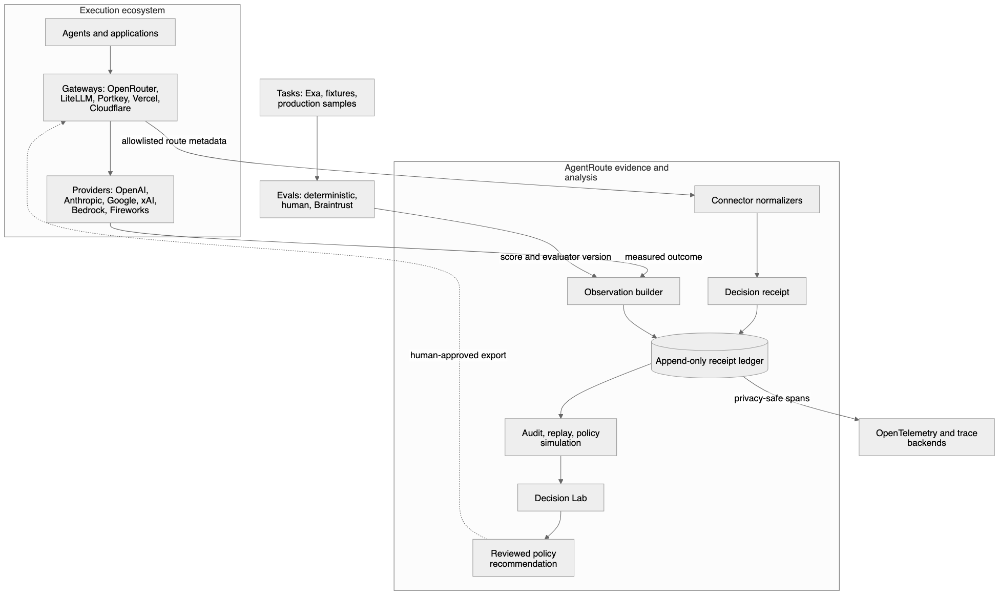

# AgentRoute

AgentRoute is a vendor-neutral evidence and policy-analysis layer for model-routing decisions. It records which candidates were known, why one was selected, what was later observed, and whether measured evidence supports a policy change. It does not proxy production traffic, silently choose models, or apply compiled policies. Shadow replay is explicit, budget-bounded, and executor-injected.



## Five-minute proof

Generate a complete deterministic evidence chain without accounts, credentials,
or network calls:

```bash
npm ci --ignore-scripts
npm run build
node dist/cli.js proof run --out local/proof-pack
node dist/cli.js proof verify local/proof-pack
```

Then open `local/proof-pack/index.html` in a browser.

Compare a candidate against a previously retained, verified proof without
exposing artifact bodies or trusting either manifest before validation:

```bash
node dist/cli.js proof diff artifacts/previous-proof local/proof-pack
node dist/cli.js proof diff artifacts/previous-proof local/proof-pack \
  --format github --fail-on-change
```

The second form is intended for CI jobs where any verified root change requires
explicit review. Both packs must pass the complete proof contract first.

Optionally sign the exact verified root with an existing Ed25519 key and pin the
expected public key during verification:

```bash
node dist/cli.js proof sign local/proof-pack \
  --private-key release-private.pem \
  -o local/proof-pack.arsig
node dist/cli.js proof verify local/proof-pack \
  --attestation local/proof-pack.arsig \
  --public-key release-public.pem
```

The signature is detached, so the deterministic proof directory remains
unchanged. Without a pinned public key, AgentRoute reports a cryptographically
valid signature as untrusted rather than inferring signer identity.

Enforce the same contract in GitHub Actions:

```yaml
- uses: abhid1234/AgentRoute/.github/actions/agentroute-proof@v0.2.0
  id: agentroute-proof
  with:
    proof-pack: artifacts/proof-pack
    attestation: artifacts/proof-pack.arsig
    public-key: .github/agentroute-release.pub.pem
    require-trusted-signature: "true"
```

The action builds its pinned AgentRoute revision, treats caller paths as data,
and emits the verified root, artifact count, signature validity, and
signer-trust state. Verify the referenced tag before adopting it in a protected
workflow.

The bundled twelve-case, four-slice results are **illustrative offline
conformance evidence**, not a live benchmark or provider-performance claim.
The 31-artifact showcase connects frozen inputs, replay receipts, a
preregistered experiment decision, quality gate, five-target dry-run promotion
dossier, evidence capsule, operational drift and SLO review, provider-outage
scenario, two-review reliability timeline, connector catalog, and two
metadata-only telemetry exports. The experiment is eligible while the outage
scenario remains visibly `attention`: evidence for a change is not the same as
proof that operating it has no risk.

## Commands

```bash
npm install
npm run build
npm test
npm run conformance
npm run test:package

node dist/cli.js route explain examples/model-routing.route.jsonl
node dist/cli.js route replay examples/model-routing.route.jsonl
node dist/cli.js route simulate examples/model-routing.route.jsonl --policy examples/fast-cheap-policy.json
node dist/cli.js report examples/can-auto-routing-prove-it.route.jsonl
node dist/cli.js audit examples/can-auto-routing-prove-it.route.jsonl
node dist/cli.js drift examples/can-auto-routing-prove-it.route.jsonl \
  examples/can-auto-routing-prove-it.route.jsonl \
  --config examples/operations-drift.json
node dist/cli.js scenario examples/model-routing.route.jsonl \
  --scenario examples/provider-outage.scenario.json
node dist/cli.js incident analyze examples/model-routing.route.jsonl
node dist/cli.js incident open examples/model-routing.route.jsonl \
  -o local/incident-review.html
node dist/cli.js slo evaluate examples/can-auto-routing-prove-it.route.jsonl \
  --config examples/routing-slo.json
node dist/cli.js ops create examples/can-auto-routing-prove-it.route.jsonl \
  --baseline examples/can-auto-routing-prove-it.route.jsonl \
  --drift examples/operations-drift.json \
  --slo examples/routing-slo.json \
  --scenario examples/provider-outage.scenario.json \
  -o local/operations.arops
node dist/cli.js ops verify local/operations.arops
node dist/cli.js ops open local/operations.arops \
  -o local/operations-review.html
node dist/cli.js history create local/operations.arops \
  -o local/reliability.arhistory
# After creating the next period's verified operations review:
node dist/cli.js history append local/reliability.arhistory \
  local/operations-next.arops
node dist/cli.js history verify local/reliability.arhistory
node dist/cli.js history open local/reliability.arhistory \
  -o local/reliability.html
node dist/cli.js lab examples/can-auto-routing-prove-it.route.jsonl -o local/decision-lab.html
node dist/cli.js connectors
node dist/cli.js connectors --status partial --json
node dist/cli.js connector test native-receipt examples/model-routing.route.jsonl
node dist/cli.js export otel-genai examples/model-routing.route.jsonl -o local/otel.json
node dist/cli.js export openinference examples/model-routing.route.jsonl -o local/openinference.json
node dist/cli.js route import vercel-ai-gateway saved-vercel-event.json
node dist/cli.js ingest cloudflare-ai-gateway saved-cloudflare-log.json --ledger local/routes.route.jsonl
node dist/cli.js evaluate braintrust saved-braintrust-score.json --ledger local/routes.route.jsonl

# Run the complete evidence suite without accounts or network calls.
node dist/cli.js arena examples/model-routing.route.jsonl \
  --tasks examples/evidence-suite.replay-tasks.json \
  --fixtures examples/evidence-suite.replay-fixtures.json \
  --max-requests 2 --max-cost-usd 0.05 \
  --ledger local/replay.route.jsonl -o local/arena-report.json
node dist/cli.js experiment analyze local/replay.route.jsonl \
  --baseline-candidate deep-review --challenger fast-review \
  -o local/experiment-report.json
node dist/cli.js experiment decide local/replay.route.jsonl \
  --protocol examples/promotion-dossier.protocol.json \
  -o local/experiment-decision.json
node dist/cli.js serve examples/model-routing.route.jsonl \
  --experiment-ledger local/replay.route.jsonl
node dist/cli.js policy registry init local/policies.registry.json
node dist/cli.js policy registry add local/policies.registry.json \
  examples/experiment-governance.policy.draft.json \
  --actor mason --reason "initial measured policy"
node dist/cli.js policy registry transition local/policies.registry.json \
  balanced-code-review@1.1.0 --to reviewed \
  --actor reviewer --reason "experiment evidence reviewed"
node dist/cli.js policy compile examples/evidence-suite.policy.json \
  --target vercel-ai-gateway -o local/vercel-policy.dry-run.json
node dist/cli.js promotion create local/replay.route.jsonl \
  --protocol examples/promotion-dossier.protocol.json \
  --policy examples/evidence-suite.policy.json \
  --baseline examples/model-routing.route.jsonl \
  --current examples/model-routing.route.jsonl \
  --gate examples/evidence-suite.gate.json \
  --target openrouter --target vercel-ai-gateway \
  -o local/review.arpromote
node dist/cli.js promotion verify local/review.arpromote
node dist/cli.js promotion open local/review.arpromote \
  -o local/promotion-review.html
node dist/cli.js capsule create examples/model-routing.route.jsonl \
  --policy examples/evidence-suite.policy.json -o local/demo.arcap
node dist/cli.js capsule verify local/demo.arcap
openssl genpkey -algorithm ED25519 -out local/capsule-private.pem
openssl pkey -in local/capsule-private.pem -pubout -out local/capsule-public.pem
node dist/cli.js capsule sign local/demo.arcap \
  --private-key local/capsule-private.pem -o local/signed-demo.arcap
node dist/cli.js capsule verify local/signed-demo.arcap \
  --require-signature --public-key local/capsule-public.pem
node dist/cli.js capsule open local/demo.arcap -o local/capsule-lab.html
```

Try the complete offline vendor path with the bundled fixtures:

```bash
node dist/cli.js ingest cloudflare-ai-gateway examples/imports/cloudflare-ai-gateway-log.json \
  --route-id route_demo_gateway --ledger local/vendor-demo.route.jsonl
node dist/cli.js evaluate braintrust examples/imports/braintrust-score.json \
  --ledger local/vendor-demo.route.jsonl
node dist/cli.js report local/vendor-demo.route.jsonl
```

The `ar` package binary accepts both `ar ...` and the historical `ar route ...` form.

Applications can also import the typed library surface after `npm run build`.
The public npm package is `@avee1234/agentroute`; the project and CLI remain
AgentRoute and `ar`:

```bash
npm install @avee1234/agentroute
```

```ts
import { importCloudflareAiGatewayRoute, replayRoutes } from "@avee1234/agentroute";

const { decision, observation } = importCloudflareAiGatewayRoute(savedLog);
const report = replayRoutes(observation ? [decision, observation] : [decision]);
```

## Included implementation

- Draft 2020-12 receipt schema for immutable decisions and later observations.
- Append-only JSONL ledger with idempotent retries and sequence validation.
- Human-readable explanation, deterministic replay analytics, and policy simulation.
- Metadata-only OpenRouter, LiteLLM, Portkey, Vercel AI Gateway, and Cloudflare
  AI Gateway imports with conservative evidence fidelity.
- Offline gateway ingestion that splits allowlisted routing facts from measured
  status, latency, cost, token, retry, and cache observations.
- Braintrust numeric-score import that never retains experiment inputs, outputs,
  evaluator reasoning, or arbitrary metadata.
- Live, non-streaming OpenRouter capture with stable router metadata and an allowlisted receipt boundary.
- Exa-backed fresh task packs plus a deterministic evaluator contract.
- Screenshot-ready receipt detail and routing reports that separate predicted from measured values.
- Audit-readiness grading that reports whether receipts can support a defensible comparison.
- A standalone, interactive Decision Lab with receipt search, candidate evidence, router traces, gaps, and a predicted policy sandbox.
- Privacy-safe OTLP/JSON export for routing decision spans.
- Explicit OpenTelemetry GenAI and OpenInference metadata-only export profiles.
- A typed connector map with capability-level readiness, so working decision
  imports are not confused with still-planned policy exports.
- A dependency-free Connector SDK conformance runner that tests manifest
  vocabulary, receipt validity, deterministic imports, and privacy canaries.
- A Shadow Replay Arena with injected executors, fixture-only CLI execution,
  hard request/cost limits, candidate-level receipts, and measured regret.
- Paired replay experiment analysis with matched-task comparisons, Wilson 95%
  uncertainty, mean quality/latency/cost deltas, and task-type slices.
- Preregistered experiment protocols that turn declared coverage, quality,
  latency, cost, success-rate, and required-slice criteria into deterministic
  pass, fail, or insufficient-evidence decisions.
- A loopback-only Live Route Observatory with a safe snapshot API and live
  ledger-change events.
- A fail-closed routing quality gate with task-slice checks and a reusable
  GitHub composite action.
- A reusable proof-verification GitHub Action with caller-workspace path
  resolution, optional detached signatures, pinned-key enforcement,
  machine-readable outputs, and adversarial command-injection coverage.
- Verified proof-to-proof diffs with deterministic artifact/root summaries,
  content-free GitHub annotations, explicit `--fail-on-change` enforcement, and
  invalid-pack refusal before comparison.
- A durable policy registry with atomic writes, guarded lifecycle history,
  explicit human approval, deterministic diffing, and dry-run compilers
  for native routers, OpenRouter, LiteLLM, Portkey, and Vercel AI Gateway.
- Tamper-evident `.arcap` evidence capsules that strip sensitive fields, support
  optional Ed25519 signer verification, and reopen as standalone Decision Labs.
- Tamper-evident `.arpromote` review dossiers that bind an experiment decision,
  route gate, sanitized policy diff, and recomputed dry-run vendor configurations
  into an eligible, blocked, or insufficient promotion verdict.
- A one-command Launch Showcase that reproducibly binds 31 offline artifacts,
  links experiment, promotion, operations, resilience, connectors, and
  longitudinal reliability, and renders three standalone limitation-labelled
  HTML review surfaces.
- Detached Ed25519 proof attestations that refuse invalid packs, preserve
  deterministic proof contents, and distinguish signature validity from trust
  in a caller-pinned public key.
- Routing drift intelligence that measures model/provider selection movement,
  outcome regression, and task-type slices against preregistered thresholds.
- Offline resilience scenarios for provider/model outages and scoped cost or
  latency shocks, using only recorded candidates and fallback order.
- Privacy-safe incident forensics with stable findings and standalone HTML for
  failed outcomes, execution mismatches, measured SLO breaches, policy
  violations, and evidence gaps.
- Deterministic routing SLO evaluation with coverage requirements, task slices,
  nearest-rank percentiles, and explicit error-budget consumption.
- Tamper-evident `.arops` review bundles that bind sanitized baseline and current
  evidence to recomputed drift, SLO, incident, and resilience results in one
  portable JSON artifact and standalone HTML review.
- Append-only `.arhistory` reliability timelines with verified operations-review
  inputs, per-entry hash chaining, atomic persistence, regression and recovery
  signals, error-budget trends, and a standalone longitudinal dashboard.
- Examples, adversarial behavioral tests, and a conformance corpus.

The format and UX constraints are documented in [`docs/agentroute-spec.md`](docs/agentroute-spec.md).
The [`UI and launch handoff`](docs/agentroute-handoff.md) records the stable
surfaces and verification boundary.

The system boundaries and the Requested → Selected → Observed → Proposed
receipt rail are documented in [`docs/architecture.md`](docs/architecture.md).
The honest capability matrix is documented in [`docs/integrations.md`](docs/integrations.md).
The full evidence-suite contracts and safety boundaries are documented in
[`docs/evidence-suite-spec.md`](docs/evidence-suite-spec.md).
Experiment statistics, policy lifecycle, signing, and slice-gate contracts are
documented in [`docs/experiment-governance-spec.md`](docs/experiment-governance-spec.md).
Preregistered decisions and promotion review artifacts are documented in
[`docs/promotion-dossiers-spec.md`](docs/promotion-dossiers-spec.md).
The reproducible public demonstration contract is documented in
[`docs/public-proof-pack-spec.md`](docs/public-proof-pack-spec.md).
The connected launch-day walkthrough and its exact truth constraints are
documented in [`docs/launch-showcase-spec.md`](docs/launch-showcase-spec.md).
Detached proof authorship and trust semantics are documented in
[`docs/proof-attestation-spec.md`](docs/proof-attestation-spec.md).
CI enforcement is documented in
[`docs/proof-verification-action-spec.md`](docs/proof-verification-action-spec.md).
Release-to-release proof review is documented in
[`docs/proof-diff-spec.md`](docs/proof-diff-spec.md).
Third-party adapter authors should start with
[`docs/connector-sdk.md`](docs/connector-sdk.md), and telemetry mappings are
documented in [`docs/interoperability.md`](docs/interoperability.md).
Applications that deliberately supply a live replay executor should follow
[`docs/live-benchmarking.md`](docs/live-benchmarking.md).
Operational drift, resilience, and incident contracts are documented in
[`docs/operations-intelligence-spec.md`](docs/operations-intelligence-spec.md).
Routing SLOs and portable operations-review bundles are documented in
[`docs/slo-operations-review-spec.md`](docs/slo-operations-review-spec.md).
Hash-chained longitudinal reliability review is documented in
[`docs/reliability-timeline-spec.md`](docs/reliability-timeline-spec.md).

The first end-to-end demo kit is documented in
[`docs/can-auto-routing-prove-it.md`](docs/can-auto-routing-prove-it.md). Its
bundled receipts are explicitly illustrative; live task generation and model
calls require user-provided environment keys and are never run implicitly.

## Release status

The public package is `@avee1234/agentroute`; the unscoped `agentroute` name is
owned by an unrelated project. Releases are built from reviewed commits, and
the release workflow prepares a tarball, SBOM, and attestations before its
protected publish job. Always verify current repository, npm, tag, workflow,
and provenance state independently rather than inferring publication from this
source tree. See [`SECURITY.md`](SECURITY.md),
[`CONTRIBUTING.md`](CONTRIBUTING.md), [`CHANGELOG.md`](CHANGELOG.md), and the
[`release procedure`](docs/releasing.md).
