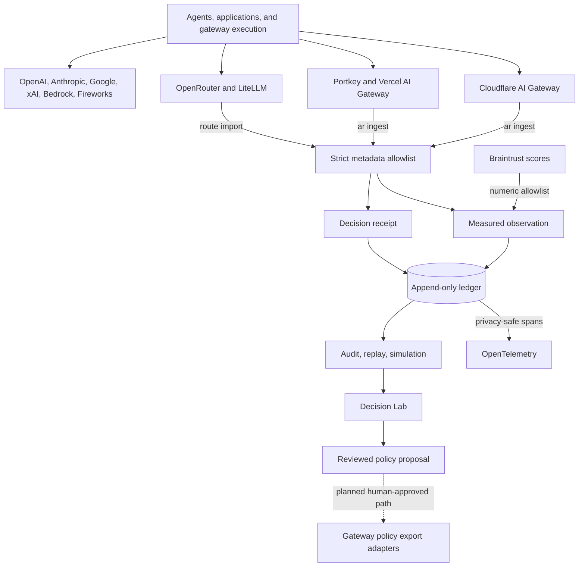

# AgentRoute architecture

AgentRoute is a vendor-neutral routing evidence and policy-analysis layer. It
does not proxy inference, own provider keys, or silently rewrite production
routing. Gateways keep executing requests; AgentRoute makes their decisions
auditable.

The rendered and editable versions live in `diagrams/agentroute-integration-plane.*`.

## The receipt rail

Decision Lab organizes each route into four stages:

1. **Requested** — what the application asked the router to execute.
2. **Selected** — the actual model/provider choice and upstream reason.
3. **Observed** — measured status, latency, cost, quality, and evaluator.
4. **Proposed** — a predicted winner under an explicitly adjusted policy.

The fourth stage is deliberately not called “better.” It is a policy
simulation over recorded routing-time scores until that alternative is actually
executed and evaluated.

## Audit readiness

Before comparing routes, AgentRoute grades the evidence needed to support a
comparison. The grade combines:

- outcome coverage;
- quality-evaluation coverage;
- complete candidate evidence;
- policy-lab score coverage;
- measured latency and cost;
- fallback visibility.

This is an instrumentation grade, not a model-quality score. Per-route gaps
explain exactly what evidence is missing and which analysis is disabled.

## Trust boundaries

- Every router and gateway adapter copies an allowlist of routing evidence
  only. Portkey, Vercel AI Gateway, and Cloudflare AI Gateway can be ingested
  from saved JSON without configuring an account in AgentRoute.
- Gateway logs are split into an immutable decision and an optional measured
  observation. Stable IDs make replayed imports idempotent.
- Braintrust score import retains evaluator identity and 0..1 numeric scores,
  but drops inputs, outputs, reasoning, and arbitrary metadata.
- Prompts, response text, credentials, headers, endpoints, and unknown extension
  objects are not included in the Decision Lab model.
- The generated Decision Lab is a standalone local HTML file with no remote
  scripts, fonts, analytics, or network requests.
- Embedded receipt data escapes HTML-significant characters, and dynamic
  content is rendered with text nodes rather than HTML injection.
- Policy controls re-rank only full candidate sets with complete quality,
  latency, and cost scores.

## Next durable layers

The architecture intentionally leaves room for three later modules without
turning AgentRoute into a gateway:

1. **Replay runner** — execute permitted alternatives and append real outcomes.
2. **Evaluator plugins** — deterministic, human, and model-judge adapters behind
   one versioned result contract.
3. **Policy registry** — reviewed, versioned recommendations with export adapters
   for OpenRouter, LiteLLM, Portkey, Vercel AI Gateway, or application-native routers.
