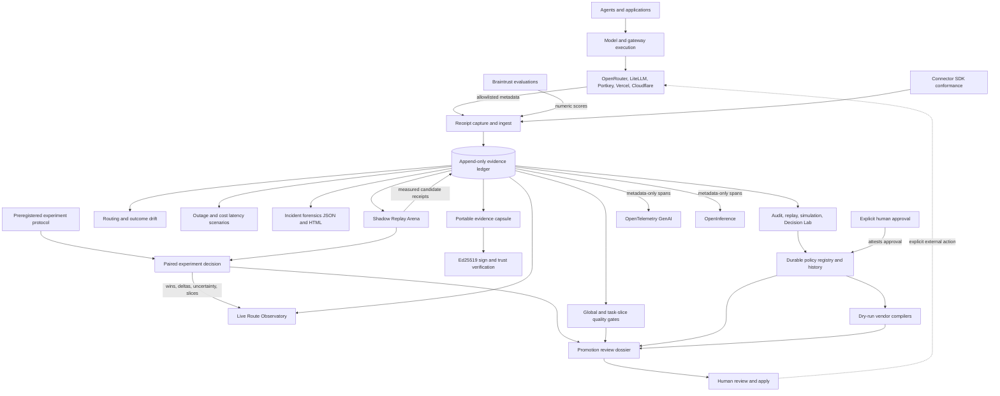
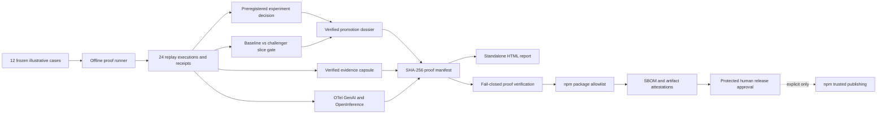

# AgentRoute architecture

AgentRoute is a vendor-neutral routing evidence and policy-analysis layer. It
does not proxy inference, own provider keys, or silently rewrite production
routing. Gateways keep executing requests; AgentRoute makes their decisions
auditable.

The rendered and editable versions live in `diagrams/agentroute-integration-plane.*`.

## The receipt rail

Decision Lab organizes each route into four stages:

1. **Requested** — what the application asked the router to execute.
2. **Selected** — the actual model/provider choice and upstream reason.
3. **Observed** — measured status, latency, cost, quality, and evaluator.
4. **Proposed** — a predicted winner under an explicitly adjusted policy.

The fourth stage is deliberately not called “better.” It is a policy
simulation over recorded routing-time scores until that alternative is actually
executed and evaluated.

## Audit readiness

Before comparing routes, AgentRoute grades the evidence needed to support a
comparison. The grade combines:

- outcome coverage;
- quality-evaluation coverage;
- complete candidate evidence;
- policy-lab score coverage;
- measured latency and cost;
- fallback visibility.

This is an instrumentation grade, not a model-quality score. Per-route gaps
explain exactly what evidence is missing and which analysis is disabled.

## Trust boundaries

- Every router and gateway adapter copies an allowlist of routing evidence
  only. Portkey, Vercel AI Gateway, and Cloudflare AI Gateway can be ingested
  from saved JSON without configuring an account in AgentRoute.
- Gateway logs are split into an immutable decision and an optional measured
  observation. Stable IDs make replayed imports idempotent.
- Braintrust score import retains evaluator identity and 0..1 numeric scores,
  but drops inputs, outputs, reasoning, and arbitrary metadata.
- Prompts, response text, credentials, headers, endpoints, and unknown extension
  objects are not included in the Decision Lab model.
- The generated Decision Lab is a standalone local HTML file with no remote
  scripts, fonts, analytics, or network requests.
- Embedded receipt data escapes HTML-significant characters, and dynamic
  content is rendered with text nodes rather than HTML injection.
- Policy controls re-rank only full candidate sets with complete quality,
  latency, and cost scores.

## Evidence workflows

- **Shadow Replay Arena** executes only through an explicitly supplied executor.
  The bundled CLI executor is offline fixtures, with hard request and cost stops.
- **Live Route Observatory** serves the safe Decision Lab projection and evidence
  health from loopback. It is read-only and has no remote assets.
- **Routing quality gate** turns measured cost, latency, quality, coverage, and
  policy violations into a deterministic pull-request check. Optional task-type
  slices prevent a healthy global average from hiding a workload regression.
- **Paired experiment analysis** compares candidates only on original tasks both
  executed, then reports wins, ties, mean deltas, Wilson uncertainty, and task slices.
- **Preregistered experiment decisions** bind success thresholds before results are
  analyzed, distinguish measured failures from missing evidence, and require every
  declared task slice to meet the same promotion contract.
- **Promotion dossiers** combine that decision with a reviewed policy, deterministic
  route gate, and dry-run vendor compilations. Their eligible, blocked, or insufficient
  verdict is recomputed during verification; the standalone review page never applies
  a policy or calls a provider.
- **Policy registry** persists an append-only lifecycle history, requires explicit
  human attestation for approval, and compiles review-only artifacts for native
  routers, OpenRouter, LiteLLM, Portkey, and Vercel AI Gateway.
- **Evidence capsules** package sanitized receipts, policies, audit, and replay
  summaries into a tamper-evident `.arcap` file that can reopen as a Decision Lab.
  Optional Ed25519 signatures separate payload integrity, signature validity, and
  trust in a pinned signer.
- **Connector conformance** validates adapter vocabulary, receipt sequences,
  deterministic imports, and privacy markers without loading third-party code.
- **Telemetry profiles** keep prompts, outputs, endpoints, credentials, and
  arbitrary extensions out of both OpenTelemetry GenAI and OpenInference spans.

## Operations-intelligence plane

- **Routing drift** compares selection distributions and measured outcomes
  between two conformant ledgers. Total-variation and per-identity changes stay
  separate from failure, latency, cost, and quality deltas. Global checks and
  task-type slices produce pass, fail, or insufficient-evidence results.
- **Resilience scenarios** model provider/model outages and cost or latency
  multipliers without live probes. They walk only the recorded selected
  candidate and fallback order, enforce the recorded route criteria, and make
  stranded routes or missing estimates explicit.
- **Incident forensics** turns failed or missing outcomes, actual-versus-selected
  execution differences, measured threshold breaches, policy violations, and
  instrumentation gaps into stable findings. Its standalone HTML contains only
  allowlisted facts and makes no root-cause claim.

These workflows remain read-only. None calls a vendor, mutates a ledger, applies
a compiled policy, or treats missing evidence as a successful measurement.

## Public proof and release plane

The release path is separate from runtime evidence. It creates reviewable
artifacts but never publishes by default.

The default corpus is large enough to exercise global and per-slice coverage,
but its outcomes remain illustrative. Live provider evidence must be generated
separately with user-supplied executors and labelled provenance. The release
workflow prepares a tarball, CycloneDX SBOM, and attestations; npm publication
requires both removal of the package's private guard and approval in the
protected `npm-publish` environment.
